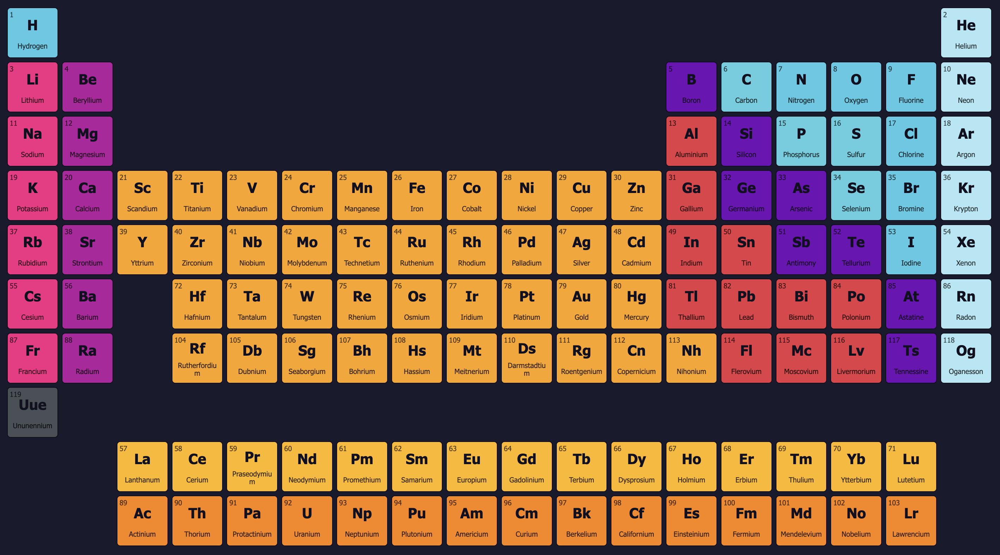

# Periodic Table

This project is a fully client-side, interactive periodic table of elements built with plain JavaScript, HTML, and CSS. It features 3D visualizations of atomic structures using Three.js for generated Bohr models and Google's `<model-viewer>` for displaying GLB/GLTF models.



## Features

*   **Complete Periodic Table:** Displays all 118 known elements.
*   **Element Search & Filtering:**
    *   Filter elements by name, symbol, or atomic number using a search bar.
    *   Filter elements by selecting single or multiple categories from a dropdown menu (includes an "All" option). The dropdown button text dynamically updates to reflect the current selection.
    *   Search and category filters can be used in combination.
    *   Non-matching elements are dimmed for clear visual feedback.
*   **Dynamic Cell Styling:** Element cells are styled with colors corresponding to their chemical group/category.
*   **Hover Tooltips:** Hovering over an element cell reveals a quick-info tooltip.
*   **Detailed Modal View:** Clicking an element cell opens a modal window with multiple tabs:
    *   **3D Model Tab (Main):**
        *   **Generated Model (Inner Tab):** A procedurally generated Bohr model of the element's atomic structure rendered with Three.js. Includes orbit controls.
        *   **GLB Model (Inner Tab):** Displays a pre-made 3D model of the element using Google's `<model-viewer>` component.
    *   **Detailed Info Tab (Main):** Comprehensive textual information about the element.
    *   **Gallery Tab (Main):** Displays various images related to the element in a responsive grid layout with a click-to-preview larger image feature.
*   **Dark Theme with Vibrant Colors:** Aesthetically pleasing dark interface using "Work Sans" and "Noto Sans Display" fonts.
*   **Pure JavaScript DOM Manipulation:** All HTML elements for the table, modal, search, and filters are created and managed via JavaScript.
*   **CSS Styling:** External CSS file (`css/style.css`) for organized styling.
*   **Dynamic Copyright:** Footer displays "Developed in [Current Year], by Kamran Yakub. This project is open source and available under the MIT License."

## Project Structure
```
.
├── css/
│   └── style.css
├── img/
│   ├── favicon.png
│   └── screenshot.png
├── js/
│   ├── elements-data.js
│   └── main.js
└── index.html
```


## Technologies Used

*   **HTML5**
*   **CSS3** (including CSS Grid and Flexbox for layout)
*   **Plain JavaScript (ES6+)**
*   **Three.js:** For the procedurally generated 3D Bohr model.
    *   `OrbitControls.js` (from Three.js examples) for 3D view interaction.
*   **Google `<model-viewer>`:** For displaying pre-made GLB/GLTF 3D models.
*   **Google Fonts:** "Work Sans" and "Noto Sans Display".
*   **Element Data:** A comprehensive JSON-like dataset (`elements-data.js`) for element properties, inspired by the [Periodic-Table-JSON project by Bowserinator](https://github.com/Bowserinator/Periodic-Table-JSON).

## Setup and Usage

1.  **Clone the repository:**
    ```bash
    git clone https://github.com/kyakub/Periodic-Table.git
    cd Periodic-Table
    ```
2.  **Run with a local web server** (due to CORS and module script requirements):
    *   Python 3: `python -m http.server`
    *   Or use a "Live Server" extension in your code editor.
3.  **Open `index.html` in your browser** via the local server.

## How It Works

*   **`index.html`:** Basic page structure, loads fonts, CSS, and JavaScript libraries/scripts.
*   **`elements-data.js`:** Array of element objects.
*   **`css/style.css`:** Visual styling for all components, including the new dropdown filter.
*   **`js/main.js`:**
    *   Dynamically creates all UI elements.
    *   Manages main and inner tabbing systems.
    *   Handles text search and multi-select category filtering logic.
    *   Renders procedural Bohr models with Three.js.
    *   Displays GLB models using `<model-viewer>`.
    *   Populates information and gallery tabs.
    *   Implements image preview and dynamic copyright.

## Known Considerations

*   **"Multiple instances of Three.js" Warning:** Due to `<model-viewer>` bundling its own Three.js and our separate include for the procedural model.
*   **`<model-viewer>` Internal Warnings:** Such as "non-passive event listener".
*   **`hook.js` Interference:** Errors involving `hook.js` are likely from browser extensions.

## Future Enhancements (Ideas)

*   More scientifically accurate 3D atomic orbital visualizations.
*   Advanced filtering by multiple properties (e.g., phase, discovery year).
*   Animations for modal/tab transitions.

## Contributing

Contributions, issues, and feature requests are welcome! Feel free to check the [issues page](https://github.com/kyakub/Periodic-Table/issues).

## License

This project is open source and available under the [MIT License](LICENSE).